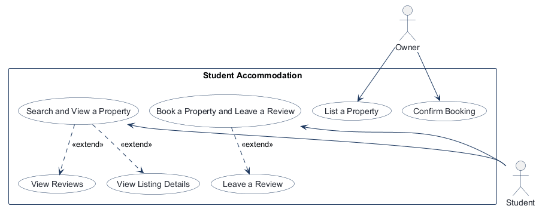
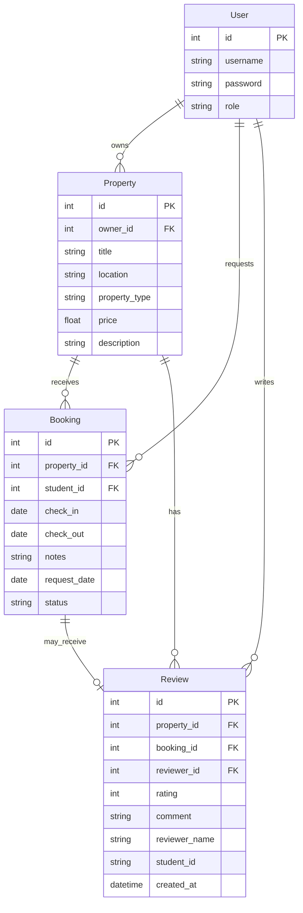

# COMP 3613 Assignment 1

Draft this file with the Guide. **Update it after every phase milestone** before you pause. The use-case diagram is a UML PNG at `docs/diagrams/use-case.png`, linked from this file as `diagrams/use-case.png` (path relative to `docs/report.md`). The model diagram is Mermaid. **Embed wireframe images** as `wireframes/<file>` (files live in `docs/wireframes/`).

Do not put your student ID in this file if you will commit it. The PDF cover adds your name and ID at export time.

## Assigned project

Student Accommodation

## Three workflows

### 1.

List a Property (Owner)

### 2.

Search and View a Property (Student)

### 3.

Book a Property and Leave a Review (Student)

## Use case diagram

Assumption: Search and View a Property extends View Listing Details and View Reviews; Leave a Review is offered immediately after a student sends a booking request; Confirm Booking is a separate Owner workflow and is not tied to List a Property.

## Model diagram

Updated in Phase 5 to match the implemented SQLModel fields, foreign keys, and review/booking lifecycle.

Model revision: the ERD now follows the implemented `id`/snake_case field names. `Booking` includes check-in/out dates, notes, request date, and the pending/confirmed/rejected status; it has no separate confirmation date. `Review` links directly to its Property and reviewer User as well as its Booking, stores reviewer name and Student ID, and automatically records `created_at` when submitted (not entered by the student). A unique `Review.booking_id` means each booking can have at most one review. Students may review a pending or confirmed booking; rejected bookings cannot be reviewed. Review cancellation is a navigation action and does not add an entity or persisted field.

## Wireframes

### List a Property and Confirm Booking

<!-- student-build:wireframe-coverage
use_case: List a Property (Owner)
image: docs/wireframes/List a Property and Confirm Booking.png
covered: yes
-->

### Search and View a Property

<!-- student-build:wireframe-coverage
use_case: Search and View a Property (Student)
image: docs/wireframes/Search and View a Property.png
covered: yes
-->

### Book a Property and Leave a Review

<!-- student-build:wireframe-coverage
use_case: Book a Property and Leave a Review (Student)
image: docs/wireframes/Book a Property and Leave a Review.png
covered: yes
-->

Accepted model revisions: `Booking.status` distinguishes pending/confirmed/rejected, with no completion step; `Review` now stores reviewer name and Student ID from the wireframe. The booking flow immediately presents “View my bookings” and “Leave a Review” after request submission.

## Theming

Branding preference: SettleIn as the product wordmark, with a warm, modern student-living aesthetic. Applied across the landing page, sign-in, register page, and authenticated app shell via the centralized CSS brand tokens and shared wordmark markup. Latest appearance polish: ivory page background, light-brown top navigation, rose-gold property cards, and warm beige-gold buttons. The Search and View hero uses the student-provided living-room image as a full-width background, with a translucent ivory overlay to keep the heading, subtitle, search field, and filters readable. Student confirmed the search hero writing and controls remain clearly readable.

## Implementation notes

One named workflow at a time. Include verify notes and polish / model revisions (Phase 5). Do not treat the first build as final.

Phase 5 polish: registration now collects username, password, and a Student/Owner role; email was removed to match the Phase 3 User entity. The seeded `bob` account is an owner. Owner accounts see listing management and the “List a property” action, while student search and booking widgets remain student-only. Listing routes and the service reject non-owners.

The listing form retains only the Phase 3 Property fields: title, location, monthly price, type, and description. Photo uploads were skipped; the form, listing cards, and detail page use a shared SettleIn placeholder image instead. Student verification confirmed Bob no longer sees student search/bookings and sees the owner “List a property” action with the expected form fields and placeholder.

Polish from that verification: the form now includes Cancel and Save Draft. Cancel clears any temporary draft and returns to the owner dashboard; Save Draft stores the five form values in this browser tab’s session storage only. Student verification confirmed the values restore after leaving and reopening the form, and Cancel clears them.

Student-registration check exposed another role mismatch: the student dashboard still showed “My listings.” That panel and its owner-list query were removed from the student view. The student rechecked and confirmed the owner-only message is gone and only “My bookings” remains in the dashboard sidebar; the student search area is retained.

Owner listing-flow polish: the owner landing dashboard now uses the wireframe heading “List a Property” and subtitle “Add a property for students to find.” After a successful publish, a one-time “Published / Your listing is now visible to students” panel appears on that dashboard, with “View my listings” linking to the owner’s listing cards. Student browser verification confirmed the heading, subtitle, and jump link.

Owner navigation now matches the wireframe’s top bar (SettleIn, List a Property, Confirm Booking, Log out), with the active page bold. Confirm Booking is a dedicated owner-only view of pending requests with Confirm and Reject actions. Student review submission is available immediately after booking request; the request confirmation provides View my bookings and Leave a Review actions. The Review form captures the required reviewer name and Student ID. Startup adds missing Review identity columns and Booking request date without dropping existing booking or listing data. Student verification confirmed the owner navigation/highlight, both booking decisions, pending-list removal, student booking confirmation actions, and review submission.

Booking lifecycle alignment: the only supported states are pending, confirmed, and rejected. Owners can confirm or reject pending requests; the prior completion action was removed. A student with a pending or confirmed request may submit one review; rejected requests cannot be reviewed.

Authentication note: the app stores the JWT in one `access_token` cookie for the `localhost:5000` origin. Logging in as another user in the same browser profile replaces that cookie, so all tabs then authenticate as the latest account. This is expected for the current single-account-per-browser-session design; use separate browser profiles or an incognito window to test simultaneous roles.

Earlier Phase 5 verification: student confirmed that the owner and student workflows, including role-specific navigation, property listing, booking confirmation/rejection, booking-request actions, and review submission, work as expected. The subsequent Search and View polish below still needs the student's local verification.

Search and View polish: the student completed Property model, repository, service, and thin-route snippets. Search now has the requested title/subtitle, price bands (under TT$1,500; TT$1,500–2,500; over TT$2,500), type filter, result count, and horizontal result cards. Price-band comparisons keep the boundary values in the middle band only. Student navigation is a top bar with Search, My bookings, and Log out; My bookings opens its own page. Property details place the placeholder photo beside the title, location, owner, booking action, and reviews link, with the description below. Book This Room opens the booking request form; View Reviews opens the separate property review list. Student verification confirmed the filters, count, cards, details, booking action, and My bookings. The student reported the Leave a Review form needed a Cancel Review action returning to property details; after it was added, the student confirmed it returns to the same property's details without submitting the review.

Further review/listing polish from the wireframe: property reviews show a profile icon beside the reviewer name and the automatically saved month/year. The existing Leave a Review form remains on the property details page, with the “Back to Book a Property” link, requested heading and feedback line, and property title/location. Owner listing details now have a “Property Details” subheading and title, location, and price placeholders; the existing Type choices are unchanged. Local verification is pending.

Skips: 1/3 used
- Photo uploads — assumed: display a shared placeholder image rather than collect or store image files.

<!-- student-build:code-check
workflow: List a Property (Owner)
form: snippet
layer: model
architecture_ok: yes
implement_confidence: 0.40
passed: yes
note: User entity role is required so registration must supply the selected student/owner role; email removed per Phase 3.
-->

<!-- student-build:code-check
workflow: List a Property (Owner)
form: snippet
layer: router
architecture_ok: yes
implement_confidence: 0.50
passed: yes
note: Student added owner-only guards to both listing-form GET and create POST handlers without persistence logic.
-->

<!-- student-build:code-check
workflow: List a Property (Owner)
form: snippet
layer: service
architecture_ok: yes
implement_confidence: 0.55
passed: yes
note: Student added the owner-role check in PropertyService before creating a listing.
-->

<!-- student-build:code-check
workflow: List a Property (Owner)
form: mcq
layer: router
architecture_ok: yes
implement_confidence: 0.35
passed: no
note: Initially selected Service for role-specific dashboard display; the router selects view context and the service enforces listing rules.
-->

<!-- student-build:code-check
workflow: List a Property (Owner)
form: choice
layer: other
architecture_ok: yes
implement_confidence: 0.60
passed: yes
note: Student chose browser-session storage instead of a database record for Save Draft.
-->

<!-- student-build:code-check
workflow: List a Property (Owner)
form: open
layer: other
architecture_ok: yes
implement_confidence: 0.65
passed: yes
note: Student verified Save Draft restores form values after navigation and Cancel clears the saved values.
-->

<!-- student-build:code-check
workflow: Search and View a Property (Student)
form: open
layer: router
architecture_ok: yes
implement_confidence: 0.65
passed: partial
note: Student spotted owner-only “My listings” content on a Student dashboard; the panel and unnecessary query were removed.
-->

<!-- student-build:code-check
workflow: Search and View a Property (Student)
form: open
layer: router
architecture_ok: yes
implement_confidence: 0.70
passed: yes
note: Student rechecked the Student dashboard; owner-only listing content is gone and My bookings remains.
-->

<!-- student-build:code-check
workflow: Confirm Booking (Owner)
form: choice
layer: other
architecture_ok: yes
implement_confidence: 0.50
passed: yes
note: Student selected a dedicated Confirm Booking page with Confirm and Reject actions, as shown in the wireframe.
-->

<!-- student-build:code-check
workflow: Confirm Booking (Owner)
form: mcq
layer: service
architecture_ok: yes
implement_confidence: 0.55
passed: yes
note: Student identified Service as the layer that coordinates pending-to-rejected decisions.
-->

<!-- student-build:code-check
workflow: Confirm Booking (Owner)
form: snippet
layer: model
architecture_ok: yes
implement_confidence: 0.60
passed: yes
note: Student constrained Booking.status to pending, confirmed, and rejected, excluding a completion state.
-->

<!-- student-build:code-check
workflow: Confirm Booking (Owner)
form: snippet
layer: repository
architecture_ok: yes
implement_confidence: 0.65
passed: yes
note: Student implemented the owner-scoped pending booking query in the repository.
-->

<!-- student-build:code-check
workflow: Confirm Booking (Owner)
form: snippet
layer: service
architecture_ok: yes
implement_confidence: 0.70
passed: yes
note: Student implemented pending request retrieval and owner/pending checks before rejection.
-->

<!-- student-build:code-check
workflow: Confirm Booking (Owner)
form: snippet
layer: router
architecture_ok: yes
implement_confidence: 0.75
passed: yes
note: Student completed the owner-only request page and thin confirm/reject action routes through BookingService.
-->

<!-- student-build:code-check
workflow: Book a Property and Leave a Review (Student)
form: choice
layer: model
architecture_ok: yes
implement_confidence: 0.70
passed: yes
note: Student chose to include reviewer name and Student ID on Review to match the wireframe.
-->

<!-- student-build:code-check
workflow: Book a Property and Leave a Review (Student)
form: snippet
layer: model
architecture_ok: yes
implement_confidence: 0.75
passed: yes
note: Student added required reviewer_name and student_id fields to ReviewBase.
-->

<!-- student-build:code-check
workflow: Book a Property and Leave a Review (Student)
form: snippet
layer: service
architecture_ok: yes
implement_confidence: 0.80
passed: yes
note: Student trims and validates name and Student ID in ReviewService and maps them to ReviewBase.
-->

<!-- student-build:code-check
workflow: Book a Property and Leave a Review (Student)
form: snippet
layer: router
architecture_ok: yes
implement_confidence: 0.80
passed: yes
note: Student binds reviewer name and Student ID in the thin review action and passes them to the service.
-->

## Deployed app

Phase 6. Public Render URL (not localhost). Markers open this to mark the three workflows.

https://

## Logins

Every account a marker needs, including extra users you added. Starter accounts:

- bob / bobpass — owner
- admin / adminpass — admin

<!-- student-build:code-check
workflow: Search and View a Property (Student)
form: snippet
layer: model
architecture_ok: yes
implement_confidence: 0.60
passed: yes
note: Student added indexes to Property.price and Property.property_type for the agreed filters.
-->

<!-- student-build:code-check
workflow: Search and View a Property (Student)
form: snippet
layer: repository
architecture_ok: yes
implement_confidence: 0.65
passed: yes
note: Student preserved text search and added optional price and type predicates; Guide added exclusive-bound flags to avoid overlapping price bands.
-->

<!-- student-build:code-check
workflow: Search and View a Property (Student)
form: snippet
layer: service
architecture_ok: yes
implement_confidence: 0.70
passed: partial
note: Student mapped the selected bands and delegated to the repository; boundary exclusivity was tightened during integration.
-->

<!-- student-build:code-check
workflow: Search and View a Property (Student)
form: snippet
layer: router
architecture_ok: yes
implement_confidence: 0.75
passed: yes
note: Student's route passes query, price band, and type to PropertyService and derives the result count without persistence logic.
-->

<!-- student-build:code-check
workflow: Search and View a Property (Student)
form: choice
layer: other
architecture_ok: yes
implement_confidence: 0.75
passed: yes
note: Student chose a separate My bookings page because the search wireframe did not show its destination.
-->

## YouTube URL

## Session transcripts

Filled when the Guide builds the report: the agent writes each Guide chat to `docs/transcripts/<slug>.md` (Copilot Agent, Cursor, or OpenCode). `python manage.py report` packages them. Do not paste chats here during the build.

## Competency (student-judge)

Filled when the report is built. Guide runs student-judge, writes `docs/judge.md`, and export appends the scorecard here.

## Skill integrity

Filled by `python manage.py report`. Do not edit the course skills.
